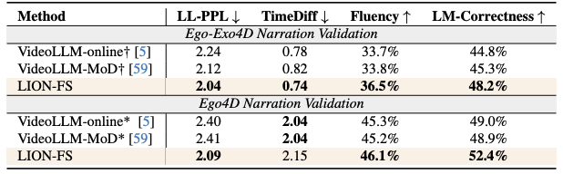
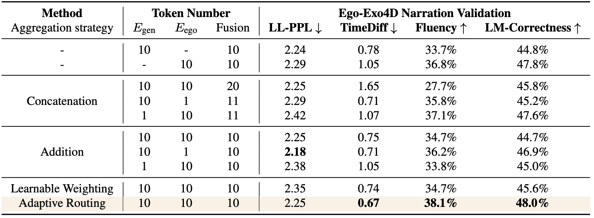
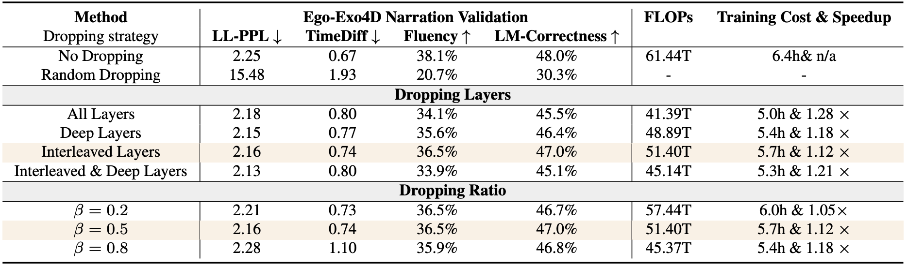

<div align="center">

<!-- <h1>JiuTian (九天) </h1> -->
<h2 class="papername">  LION-FS: Fast &amp; Slow Video-Language Thinker as Online Video Assistant</h2>
<div>
<div>
    <a href="https://orcid.org/0009-0007-7675-3550" target="_blank">Wei Li</a>,
    <a href="https://scholar.google.com/citations?user=rxaiRMUAAAAJ" target="_blank">Bing Hu</a>,
    <a href="https://rshaojimmy.github.io/" target="_blank">Rui Shao*</a>,
    <a href="https://www.slywiki.cn/" target="_blank">Leyang Shen</a>,
    <a href="http://faculty.hitsz.edu.cn/guanweili" target="_blank">Liqiang Nie</a>
</div>

School of Computer Science and Technology, Harbin Institute of Technology, Shenzhen<br>
*Corresponding author


[](https://arxiv.org/abs/2503.03663)

</div>

</div>

## :fire: If you find this work useful for your research, please kindly cite our paper and star our repo.

## :fire: Updates
- [12/2025] Code released. Enjoy it!
- [03/2025] [Arxiv paper](https://arxiv.org/abs/2503.03663) released.
- [02/2025] LION-FS has been accepted by CVPR 2025!

## Introduction

This is the github repository of *LION-FS: Fast &amp; Slow Video-Language Thinker as Online Video Assistant*. In this work, we propose “Fast & Slow Video-Language Thinker” as onLIne videO assistaNt, LION-FS, achieving real-time, proactive, temporally accurate, and contextually precise responses.

The whole framework of LION-FS:

<div align="center">

</div>

## Installation
Ensure you have Miniconda and Python version >= 3.10 installed, then run:
```sh
conda install -y pytorch torchvision torchaudio pytorch-cuda=12.1 -c pytorch -c nvidia
pip install transformers accelerate deepspeed peft editdistance Levenshtein tensorboard gradio moviepy submitit
pip install flash-attn --no-build-isolation
```

Install newest ffmpeg following:
```sh
wget https://johnvansickle.com/ffmpeg/releases/ffmpeg-release-amd64-static.tar.xz
tar xvf ffmpeg-release-amd64-static.tar.xz
rm ffmpeg-release-amd64-static.tar.xz
mv ffmpeg-7.0.2-amd64-static ffmpeg
```

## How to run
```sh
sh scripts/ego_exo4d/train.sh
```

## Experiments

**Performance.**  LION-FS consistently outperforms other methods, particularly in Fluency and LM-Correctness metrics,
showcasing its advanced capabilities in language modeling and temporal alignment.

<div align="center">

</div>

**Ablation Study on Token Aggregation Router.** 
Experiments show that SigLIP
outperforms EgoVLPv2 in LL-PPL and TimeDiff, while
EgoVLPv2 excels in Fluency and LM-Correctness. These
findings highlight the limitations of using on a single visual
encoder, as it cannot provide comprehensive visual information. Features from two different encoders can complement each other, offering a more complete representation
<div align="center">

</div>

**Ablation Study on Token Dropping Router**. The results demonstrate that even with fewer visual tokens, LION-FS achieves satisfactory efficacy, highlighting the importance of the token dropping router’s visual selection capability and revealing
the significant redundancy present in video data.


<div align="center">

</div>

## Acknowledgement
- We built our code based on: [VideoLLM-online](https://github.com/showlab/videollm-online).

## Citation

If you find this work useful for your research, please kindly cite our paper:

```
@inproceedings{li2025lion,
  title={Lion-fs: Fast \& slow video-language thinker as online video assistant},
  author={Li, Wei and Hu, Bing and Shao, Rui and Shen, Leyang and Nie, Liqiang},
  booktitle={Proceedings of the Computer Vision and Pattern Recognition Conference},
  pages={3240--3251},
  year={2025}
}
```

